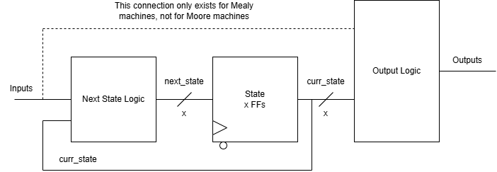
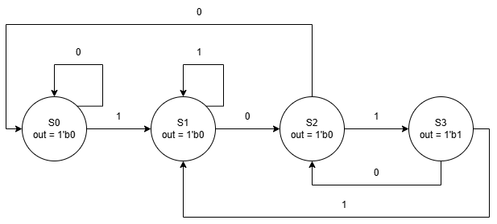
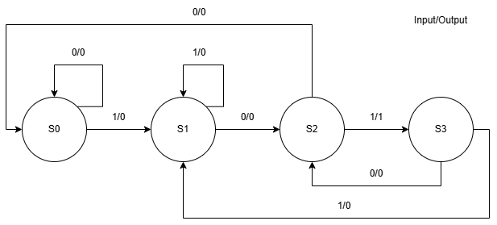

# ECE 27000 - Finite State Machines

## Overview
In general, Finite State Machines are a mathematical tool that can be used to represent any system that will be shifting through multiple states or phases. They could be used for game design, to represent the different states of a game (in a level, menu, win condition, etc), or for lexical processors to identify whether 

- **Why it Exists:** Discuss the historical background of the topic and its development. Why was it first introduced or studied? What problems or needs did it address when it emerged?
- **How We Got Here:** Outline the evolution of the topic. Mention any key milestones, discoveries, or advancements that led to its current form or understanding.
- **Motivation:** Provide the motivation for why this topic is important to learn. How does it apply to real-world problems or fields of study? What will understanding this topic allow the reader to achieve or improve?

## Key Concepts & Definitions

List and explain key terms and concepts related to the topic.

- **Concept 1:** Brief description or definition.
- **Concept 2:** Brief description or definition.
- **Concept 3:** Brief description or definition.

## Theory 
Finite State Machines are used to represent sequential logic in digital circuit design. In previous engineering classes, you may have worked with flowcharts to understand how a process works, or how a program should function. While these work at a high level for sequential logic design, we frequently need an even more detailed mechanism to design our sequential logic.
Thus, instead of using flowcharts for complete design of digital logic, we have FSMs, which use **current inputs** to update the **next state** of the machine, and then use some combination of **current inputs** and **current state** to create the **outputs** of the machine. This process is shown in a small RTL diagram below.

### Moore vs. Mealy
There are two main types of FSM, Moore and Mealy. The fundamental difference between Moore and Mealy state machines is how the outputs of the state machine are determined.

In a **Moore** state machine, outputs are determined solely by the current state of the FSM. In a **Mealy** machine, outputs are determined by a combination of the current state of the FSM and the current inputs to the FSM.
When FSMs are used as a theoretical/mathematical tool, there is no specific benefit to using one type over the other. In practical use, however, Moore state machines are typically preferred, as slight noise on the input won't cause noise on the output.

### Application
#### Example Moore Machine - 101 Sequence Detector

#### Example Mealy Machine - 101 Sequence Detector

As you can see from the two different FSM diagrams, the Moore machine has its outputs defined within the states themselves, while the Mealy machine has its outputs defined on transition edges.
