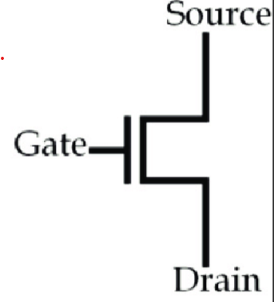
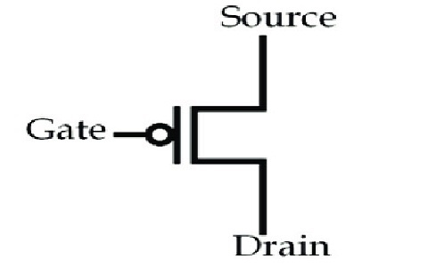
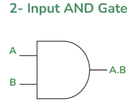
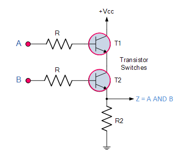
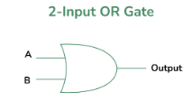
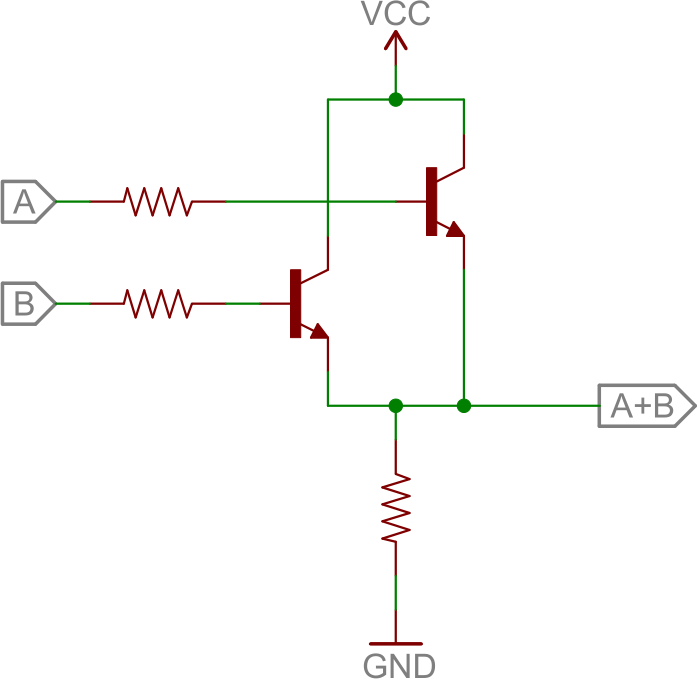
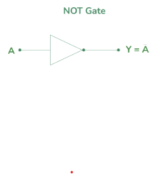
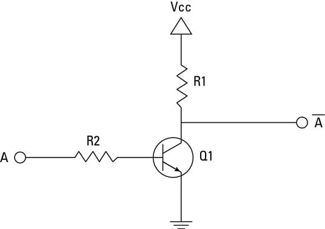

# ECE 27000 - Logic Gates

## Overview

Logic gates form the foundation of digital electronics, enabling computational devices to process binary data. These gates evolved from early relay and vacuum tube circuits to modern semiconductor-based implementations using transistors. Their invention was crucial for the development of digital computing and is essential for modern microprocessors, memory devices, and integrated circuits.

- **Why it Exists:**  
  The need for automation and complex calculations in the early 20th century led to the development of electronic switches. Logic gates were first implemented using mechanical relays and vacuum tubes before being miniaturized with transistors in the mid-20th century.

- **How We Got Here:**  
  The shift from mechanical computing to electronic circuits was pioneered by Claude Shannon, who applied Boolean algebra to circuit design. The invention of the transistor in 1947 revolutionized logic gate design, allowing for the development of compact and efficient integrated circuits.

- **Motivation:**  
  Logic gates are the building blocks of all digital systems, from simple calculators to advanced artificial intelligence processors. Understanding them is fundamental for designing circuits, debugging hardware, and optimizing digital systems.

## Key Concepts & Definitions

- **Transistors:** Semiconductor devices that function as switches, forming the basis of logic gates.
- **AND Gate:** Outputs HIGH only if both inputs are HIGH.
- **OR Gate:** Outputs HIGH if at least one input is HIGH.
- **NOT Gate:** Inverts the input signal.

## Theory

### Transistors

Transistors are the building blocks of logic gates, acting as electronic switches that control the flow of current. They consist of three terminals: the source, drain, and gate. By applying a voltage to the gate terminal, the transistor can be turned ON or OFF, allowing current to flow or blocking it. There are 2 main types of transistors used in logic gates: NMOS (N-channel Metal-Oxide-Semiconductor) and PMOS (P-channel Metal-Oxide-Semiconductor).

#### NMOS Transistor

NMOS transistors are turned ON when a positive voltage is applied to the gate terminal, allowing current to flow from the drain to the source. When the gate voltage is LOW, the transistor is OFF, blocking current

#### PMOS Transistor

PMOS transistors are turned ON when a negative voltage is applied to the gate terminal, allowing current to flow from the source to the drain. When the gate voltage is HIGH, the transistor is OFF, blocking current.

### AND Gate

#### Logical Operation

The AND gate outputs HIGH (1) only when both inputs are HIGH. Otherwise, the output is LOW (0).

#### Truth Table

| A   | B   | Output (A ⋅ B) |
| --- | --- | -------------- |
| 0   | 0   | 0              |
| 0   | 1   | 0              |
| 1   | 0   | 0              |
| 1   | 1   | 1              |

#### Transistor Schematic

---

### OR Gate

#### Logical Operation

The OR gate outputs HIGH if at least one of its inputs is HIGH.

#### Truth Table

| A   | B   | Output (A + B) |
| --- | --- | -------------- |
| 0   | 0   | 0              |
| 0   | 1   | 1              |
| 1   | 0   | 1              |
| 1   | 1   | 1              |

#### Transistor Schematic

---

### NOT Gate

#### Logical Operation

The NOT gate inverts the input signal. If the input is HIGH, the output is LOW, and vice versa.

#### Truth Table

| A   | Output (¬A) |
| --- | ----------- |
| 0   | 1           |
| 1   | 0           |

#### Transistor Schematic

---

## Applications

Logic gates are fundamental to circuits that perform arithmetic operations, memory storage, and data processing. They are found in:

- **Computers & Processors:** Logic gates form the basis of ALUs (Arithmetic Logic Units) in CPUs.
- **Memory Devices:** Used in flip-flops and latches for storing bits.
- **Control Systems:** Found in decision-making circuits in embedded systems.

### Constructing All Logic Gates from Basic Gates

The three fundamental logic gates—AND, OR, and NOT—are the building blocks of all digital logic circuits. By combining these basic components, we can construct more complex gates such as NAND, NOR, XOR, and XNOR, which are essential for advanced computational functions. This ability to derive all logic operations from a minimal set of gates is fundamental to digital circuit design.

For a detailed explanation of how these gates can be constructed using AND, OR, and NOT, refer our paper on [Boolean Algebra](./Boolean%20Algebra.md).

### Example with Formula

Boolean algebra governs the behavior of logic gates. The basic equation for an AND gate is:

$$
Y = A \cdot B
$$

Similarly, for an OR gate:

$$
Y = A + B
$$

For a NOT gate:

$$
Y = \overline{A}
$$
