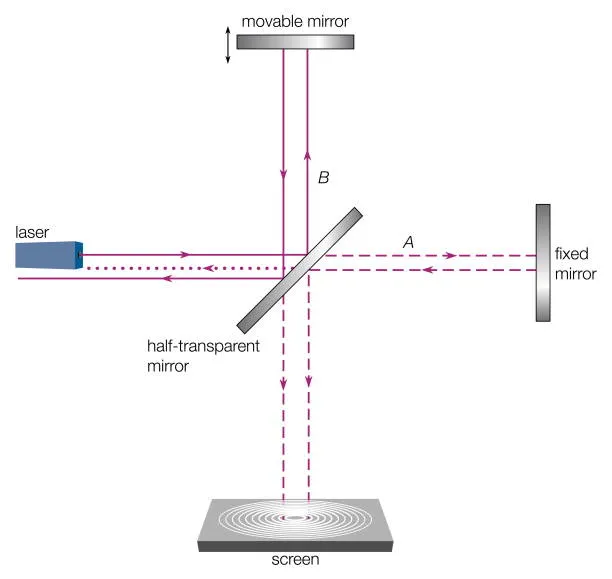
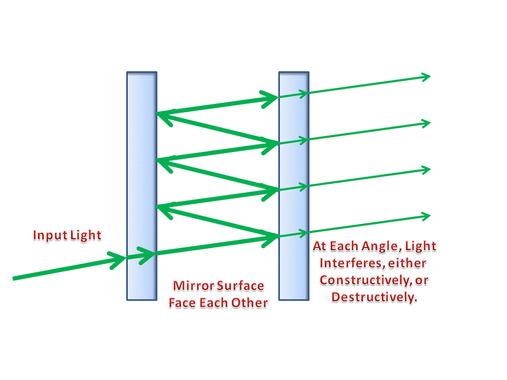
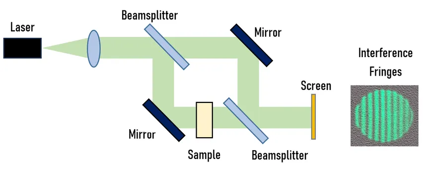

# ECE 30416 Interferometry

## Overview
Interferometry, in optics, is an invaluable technique based on how light waves interfere together - where 2 or more overlapping light waves are 
used to take precise measurements of wavelength, distance, refractive index, and surface quality. Interferometry is essential in theoretical 
physics, applied physics and engineering. Whether you are measuring tiny displacements in nanometers or detecting gravitational waves across 
the universe, unseen or very small effects require the precision sensitivity interferometry can produce relative to the challenges faced in the 
modern physical sciences and engineering.

 - **Motivation:**
    Numerous optical systems utilize measurements that surpass the resolution limits of traditional imaging. Interferometers can measure remarkably small path length differences, making them better suited for areas like surface metrology, fiber optics, telecommunications, astronomy, and materials science. An example of an interferometer is LIGO (Laser Interferometer Gravitational-Wave Observatory), which uses a Michelson interferometer to make measurements of gravitational waves that are ultimately subatomically precise. Systems like this can only be achieved by extremely precise interference-based measurements.

## Key Concepts & Definitions
- **Interference:** A phenomenon that occurs when two or more coherent light waves overlap, resulting in a pattern of bright and dark fringes due to constructive and destructive interference.
- **Optical Path Length (OPL):** The product of the refractive index of a medium and the physical length that light travels through it. Differences in OPL are what cause interference.
- **Coherence:** A property of waves that enables stable interference. Temporal coherence refers to how consistent the phase of a wave is over time, and spatial coherence refers to phase uniformity across space.
- **Fringe Pattern:** A set of alternating light and dark lines or bands created as a result of interference. Analyzing fringe shifts allows us to measure changes in optical path differences with extreme precision.

## Theory 
Interferometers work by splitting a coherent light beam into two or more paths and then recombining the beams after introducing a phase difference. The resulting interference pattern depends on the optical path difference between the beams. This principle can be used to detect minute changes in displacement, refractive index, wavelength, or surface irregularities.

𝐼 = 𝐼_1 + 𝐼_2 + 2*sqrt(𝐼_1 * 𝐼_2) * cos(Δ𝜙)

Where:
- 𝐼 is the **resulting intensity**
- 𝐼_1 and 𝐼_2 are the **intensities of the two beams**
- Δ𝜙 is the **phase difference** between the two paths

**Michelson Interferometer**
One of the earliest and most iconic interferometers, the Michelson splits light into two perpendicular paths using a beam splitter. The beams are reflected back by mirrors and recombined to form interference fringes. Changes in path length between the arms lead to shifts in the fringe pattern. It’s widely used in metrology, surface testing, and was historically significant in the Michelson-Morley experiment.

**Fabry–Perot Interferometer**
This configuration uses two partially reflective mirrors placed facing each other. Light bounces multiple times between the mirrors, producing sharp and high-resolution interference fringes. It is often used for precise spectral line measurements and laser cavity design.

**Mach–Zehnder Interferometer**
This interferometer splits the beam using a beam splitter, sends it through two separate paths (which may pass through different materials or environments), and recombines it using another beam splitter. It's ideal for measuring phase changes due to external influences such as heat, pressure, or fluid flow.

### Application
#### Measuring Refractive Index Change
Interferometers are frequently used to detect changes in the refractive index of a material. As the index changes, so does the optical path length, resulting in a measurable shift in the interference pattern.

Δ𝑛 = 𝑚𝜆 / 𝐿
 
Where:

𝑚 is the **number of fringe shifts** observed
𝜆 is the **wavelength** of the laser source
𝐿 is the **length** of the sample or material through which the light travels

This technique can detect changes in refractive index as small as 10^−7, which is useful in environmental sensing, biomedical applications, and materials testing.

### Example Exercises
- Draw labeled diagrams of Michelson, Fabry–Perot, and Mach–Zehnder interferometers. Indicate beam splitters, mirrors, and paths.

- Derive the interference condition for constructive and destructive interference in a Fabry–Perot cavity.

- Using the given formula, calculate the change in refractive index for a system where the laser has a wavelength of 632.8 nm, the material length is 10 mm, and 5 fringes are observed.

- Design a Mach–Zehnder interferometer setup to detect the presence of a gas with a different refractive index flowing through one arm of the interferometer.

