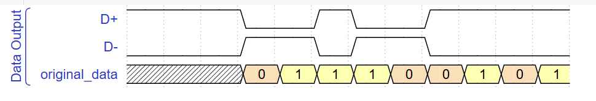
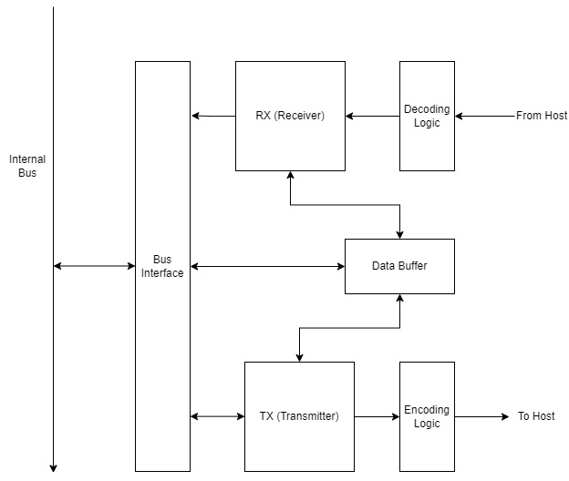

# ECE 33700 - USB

## Overview

USB (Universal Serial Bus) is an interface for power delivery and data transfer between electronic devices. USB evolved in the late 1990s to replace a collection of different and conflicting interfaces. Since then, it has gone through four generations and has become the de facto standard for connecting peripherals to computers.

- **Why it Exists:** USB was developed in 1996 to replace a collection of different interface types that were commonly used on computers at the time, such as PS/2, SCSI, and serial and parallel ports. It was intended to be a standardized interface that would be used to connect peripherals for data transfer and power delivery. 
- **How We Got Here:** USB was gradually adopted in the late 1990s, as it underwent iterations and more computers and peripherals began to include USB ports. USB 2.0 and brought higher speeds and increased power delivery. Full duplex capability and more speed increases came about with USB 3.0. USB 4.0 added tunneling, which allows data from protocols such as PCIe to be transferred. Various connector types were developed for USB, with Type-A and Type-C being the most commonly used.
- **Motivation:** USB is a common way to transfer data between devices of all kinds. Understanding the USB protocol is important for designing a digital system that needs to communicate in a standardized way with other devices.

## Key Concepts & Definitions

- **Host:** A device initiating the transfer of data (e.g. a computer).
- **Endpoint:** The termination of a connection to a device (e.g. a peripheral device, such as a keyboard, mouse, or flash drive).
- **Buffer:** Memory used to temporarily hold data.
- **Packet:** Segment of data transferred over a connection.

## Theory

### USB packets
USB packets consist of several different parts which ensure that data is transmitted correctly and to/from the right location. There are four types of USB packets.
- **Token:** Sent by the host device; indicates that it wants to send or receive data.
- **Data:** Contains data to be transferred to/from either device.
- **Handshake:** Communicates the status of the device.
    - **ACK** packets acknowledge that data has been received successfully.
    - **NAK** packets indicate that the device cannot send or receive data.
    - **STALL** packets indicate various types of errors.
- **Start of Frame:** Sent by the host to split the sending of packets into time segments.

Each packet contains different segments of data that specify the type of packet, the device the packet is for, the data being sent (if any), and checks to verify the transmitted data. The specific bytes being sent depend on the type of packet. 
This might seem like a lot of information to include in a single packet of data, but all these components are part of the USB protocol so that data can be transferred back and forth quickly between host and endpoint with as few errors as possible.

### Encoding the data
USB uses NRZI (Non-Return-to-Zero Inverted) encoding to transmit data reliably. This is used to prevent the data line from staying at a logic high or low state for a long time, allowing the receiving device to  synchronize with the clock of the sender correctly and properly decode the data. This involves the use of two signals, called a **differential pair**, that are always at opposite logical values.

A short example of NRZI-encoded data is shown below. Notice that when the original data signal stays at a logic 1 or 0 for more than one clock cycle, the encoded signals toggle. Otherwise, they remain the same when the original signal toggles.

There are many more details about the USB protocol that can be found online (the USB 1.1 specification is available [here](http://esd.cs.ucr.edu/webres/usb11.pdf)), but these are the basic ideas of its functionality.

### Application - USB transceiver

A USB transceiver is part of a USB device that can send and receive data using the USB protocol. Its main contents are the RX (receiver), TX (transmitter), and bus interface (manages the signals between the transceiver and the device's internals). A data buffer is used to temporarily store data during transmission and reception of data. An block diagram of a USB transceiver on an endpoint device is shown below.

(The internal bus on the endpoint device is shown as a line on the left of the diagram).

A transceiver is located in most USB devices, and is needed to send and receive data to/from the host device with USB (for instance, a computer connected to a USB keyboard).
